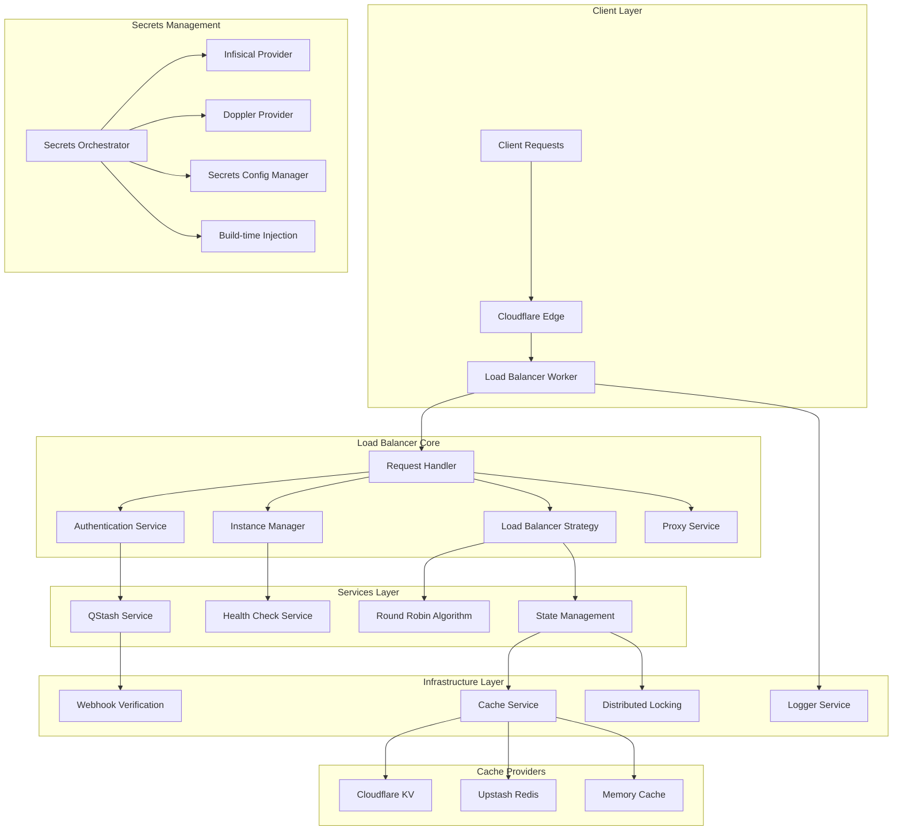
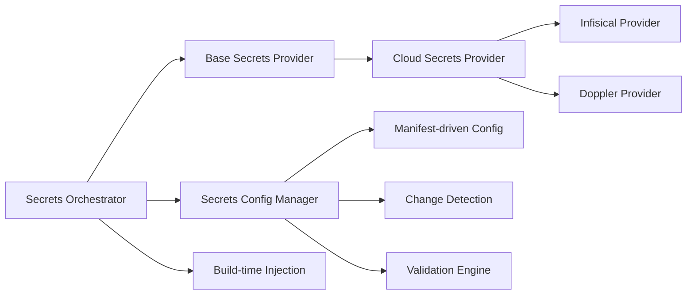
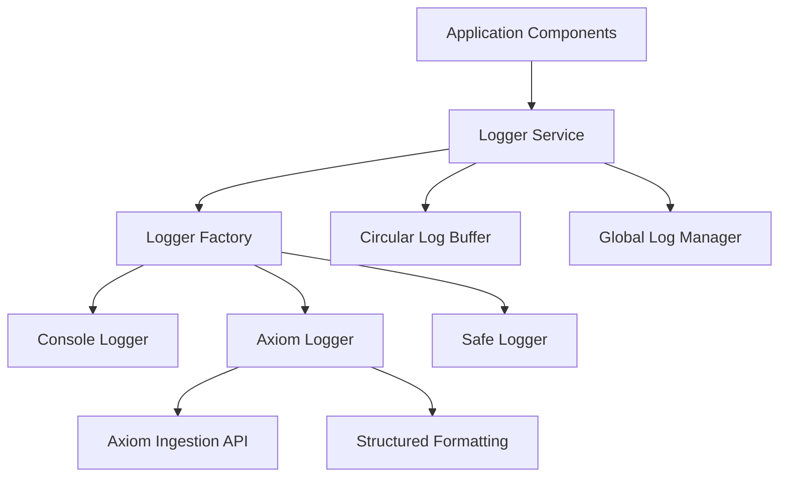
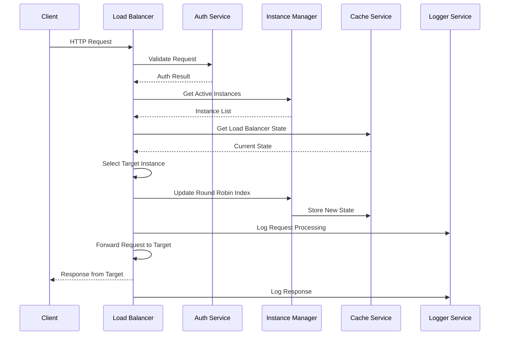
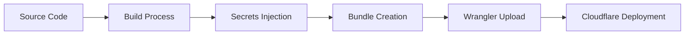

# 📐 系统架构概览

Load Balancer Worker 采用模块化、事件驱动的微服务架构，支持高可用、可扩展的负载均衡和 secrets 管理。

## 🏗️ 整体架构图



## 🧩 核心组件详解

### 1. Request Handler Layer (`src/handler.js`)
**职责**: 统一入口点，请求路由和分发

**关键特性**:
- 统一的请求预处理
- 错误处理和响应格式化
- 请求上下文管理
- 中间件支持

### 2. Authentication Service (`src/auth/`)
**职责**: 身份验证和权限控制

**子组件**:
- `admin.js`: 管理员 API 认证
- `qstash.js`: QStash webhook 签名验证

**支持的认证方式**:
- QStash Signature V2 (推荐)
- Admin API Token
- Header-based 认证

### 3. Instance Manager (`src/core/InstanceManager.js`)
**职责**: 实例发现、注册和健康监控

**核心功能**:
- 实例注册和心跳检测
- 动态实例发现
- 健康状态管理
- 故障实例隔离

### 4. Load Balancer Strategy (`src/core/LoadBalancerStrategy.js`)
**职责**: 负载均衡算法和策略管理

**支持的策略**:
- **Round Robin**: 轮询分发
- **Weighted Round Robin**: 权重轮询
- **Health-Based**: 基于健康状态分发
- **Sticky Sessions**: 会话保持

### 5. Proxy Service (`src/core/ProxyService.js`)
**职责**: HTTP 请求转发和代理

**关键特性**:
- 请求头转发
- 超时控制
- 重试机制
- 错误传播

## 💾 存储层架构

### Cache Service (`src/cache/`)
**设计模式**: 抽象工厂 + 策略模式

**核心组件**:
- `CacheService.js`: 统一缓存接口
- `BaseCache.js`: 抽象基类
- `CloudflareKVCache.js`: KV 实现
- `RedisTLSCache.js`: Redis 实现

**特性**:
- 统一接口，支持多 provider
- 自动故障转移
- 连接池管理
- 性能监控

### Distributed State Management
**组件**: `src/state/LoadBalancerState.js`

**功能**:
- 分布式锁实现
- 轮询索引管理
- 领导者选举
- 状态同步

## 🔐 Secrets 管理架构

### 分层设计



### 核心组件

#### Secrets Orchestrator (`src/config/SecretsOrchestrator.js`)
**职责**: 构建时 secrets 注入和管理

**功能**:
- 多 provider 支持
- 自动注入到构建流程
- 验证和错误处理
- 元数据生成

#### Provider 继承体系
```
BaseSecretsProvider (抽象基类)
    ↓
CloudSecretsProvider (通用云实现)
    ↓
InfisicalSecretsProvider / DopplerSecretsProvider
```

#### Secrets Config Manager (`src/config/SecretsConfigManager.js`)
**职责**: Manifest 驱动的配置管理

**功能**:
- 服务到 secret 映射
- 环境特定配置
- 验证规则引擎
- 重初始化策略

## 📊 日志系统架构

### 分层设计



### 核心组件

#### Logger Service (`src/logger/`)
**设计模式**: 工厂模式 + 适配器模式

**组件**:
- `LoggerService.js`: 统一日志接口
- `createLoggerFactory.js`: 日志工厂
- `BaseLogger.js`: 抽象基类

**特性**:
- 结构化日志记录
- 多 sink 支持 (Console, Axiom)
- 上下文感知日志
- 性能监控集成

#### OpenTelemetry 集成
- 分布式追踪支持
- 性能指标收集
- Axiom 数据管道
- 自动错误追踪

## 🔄 事件驱动架构

### 事件流设计



### 事件类型

| 事件类型 | 触发组件 | 说明 |
|---------|-----------|------|
| `request.received` | Handler | 收到新请求 |
| `auth.validated` | Auth Service | 身份验证完成 |
| `instances.updated` | Instance Manager | 实例列表更新 |
| `cache.updated` | Cache Service | 缓存状态变更 |
| `balancing.decision` | Load Balancer | 负载均衡决策 |
| `error.occurred` | All Components | 错误事件 |

## 🔧 扩展性设计

### 插件化架构
- **Provider 模式**: 缓存、secrets、日志提供者
- **中间件支持**: 请求处理管道
- **事件监听**: 组件解耦通信
- **配置驱动**: manifest 声明式配置

### 水平扩展能力
- **多实例部署**: 无状态设计支持水平扩展
- **分布式协调**: 基于缓存的协调机制
- **负载分布**: 自动流量分配
- **故障恢复**: 自动故障检测和恢复

## 📈 性能优化

### 缓存策略
- **多级缓存**: L1 (内存) → L2 (KV) → L3 (Redis)
- **智能预取**: 基于访问模式预取数据
- **压缩存储**: 大数据自动压缩
- **TTL 管理**: 智能过期时间设置

### 并发处理
- **异步 I/O**: 非阻塞操作设计
- **连接池**: 数据库和外部服务连接复用
- **批处理**: 批量操作优化
- **流式处理**: 大数据流式传输

### 内存管理
- **对象池**: 重用对象减少 GC 压力
- **缓冲区管理**: 高效的内存缓冲
- **垃圾回收**: 及时释放不必要资源
- **内存监控**: 实时内存使用跟踪

## 🛡️ 安全架构

### 多层安全
```
┌─────────────────────────────────────────┐
│           Request Layer            │
├─────────────────────────────────────────┤
│        Authentication Layer        │
├─────────────────────────────────────────┤
│       Business Logic Layer       │
├─────────────────────────────────────────┤
│         Data Access Layer        │
├─────────────────────────────────────────┤
│       Infrastructure Layer        │
└─────────────────────────────────────────┘
```

### 安全特性
- **输入验证**: 严格请求参数验证
- **输出编码**: 安全的响应编码
- **加密传输**: TLS/SSL 强制加密
- **审计日志**: 完整操作审计记录
- **权限控制**: 细粒度权限管理

## 🚀 部署架构

### 构建流程


### 环境支持
- **开发环境**: 本地开发，热重载
- **预生产**: 生产镜像，测试验证
- **生产环境**: 高可用，性能优化
- **CI/CD**: GitHub Actions 自动部署

## 📊 监控和可观测性

### 三大支柱
1. **指标 (Metrics)**: 性能指标收集
2. **日志 (Logs)**: 结构化日志记录
3. **追踪 (Traces)**: 分布式请求追踪

### 监控组件
- **健康检查**: 系统健康状态监控
- **性能监控**: 延迟、吞吐量监控
- **错误监控**: 错误率和类型分析
- **资源监控**: 内存、CPU 使用监控

## 🔄 数据流设计

### 请求处理流程
```
Client Request
    ↓
[Edge Routing]
    ↓
[Load Balancer Worker]
    ↓
[Authentication]
    ↓
[Instance Discovery]
    ↓
[Load Balancing Decision]
    ↓
[Request Forwarding]
    ↓
[Response Processing]
    ↓
Client Response
```

### 状态同步流程
```
State Change Event
    ↓
[Distributed Lock Acquisition]
    ↓
[State Update]
    ↓
[Lock Release]
    ↓
[Event Broadcasting]
```

---

## 🔗 相关文档

- [🔐 Secrets 管理架构](./secrets-architecture.md)
- [💾 缓存系统设计](./cache-system.md)
- [⚖️ 负载均衡策略](./load-balancing.md)
- [📊 监控和可观测性](./monitoring-observability.md)

---

**💡 提示**: 本架构设计支持高可用、可扩展的生产部署，确保系统的稳定性和性能。